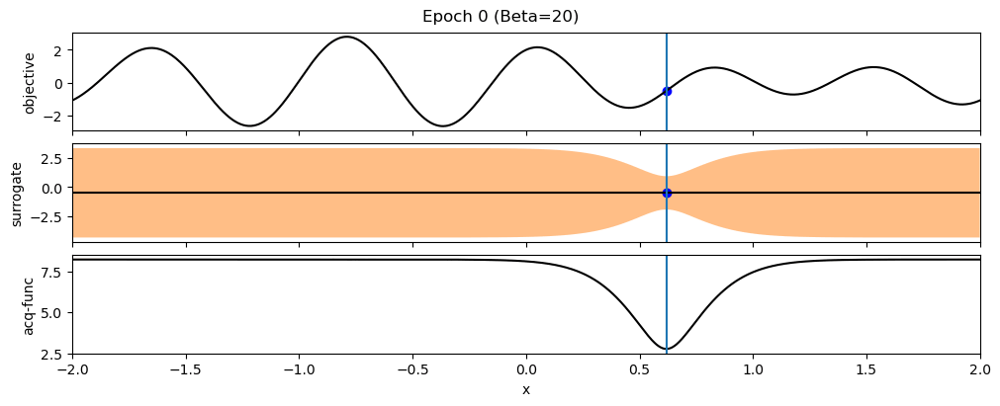
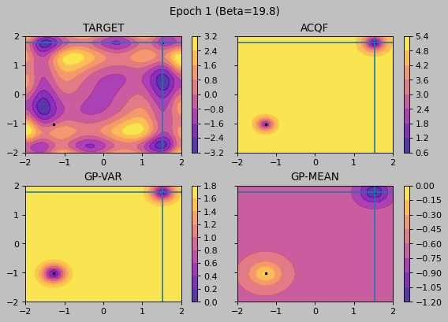

# Bayesian-Optimization-Guide
For a 5th semester module i wrote a paper about the principals about Bayesian Optimization. I therefore tried to create some small examples and visualizations to help me understanding its essence.

## Setup
Install all necessary requierments automatically using the conda environment manager:
```
conda env create -f environment.yml
```

## Experiments
All major experiments are stored in bayesian_optimization.ipynb!

## Gifs

### 1-D Example


### 2-D Example


## Questions
Just write an Issue for this repository, i will answer as soon as possible.